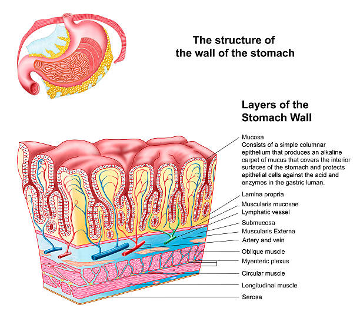

<!-- START doctoc generated TOC please keep comment here to allow auto update -->
<!-- DON'T EDIT THIS SECTION, INSTEAD RE-RUN doctoc TO UPDATE -->
**Table of Contents**  *generated with [DocToc](https://github.com/thlorenz/doctoc)*

- [Gut Lumen](#gut-lumen)

<!-- END doctoc generated TOC please keep comment here to allow auto update -->

# Gut Lumen

The **gut lumen** is the hollow interior space of the gastrointestinal tract —
the cavity inside the intestinal wall where food, digestive secretions, and the
microbiota reside. It runs from the mouth to the anus.

  

Structurally, the lumen is bounded by four layers of the intestinal wall. 
This table lists them from the inside to the outside.

| Layer                  | Key Feature                                                                  |
|------------------------|------------------------------------------------------------------------------|
| **Mucosa** (innermost) | Epithelial lining with villi/crypts; goblet cells, Paneth cells, enterocytes |
| **Submucosa**          | Connective tissue; blood vessels, nerves (Meissner's plexus)                 |
| **Muscularis**         | Smooth muscle; peristalsis; Auerbach's plexus                                |
| **Serosa** (outermost) | Mesothelial covering                                                         |

In the context of immunology, the lumen matters.

- It is the compartment where [commensal bacteria](CommensalBacteria.md)
  live (~10¹¹ bacteria/g in the colon).
- It is where **Pathogen-Associated Molecular Patterns (PAMPs)** (e.g., 
  peptidoglycan, LPS, flagellin) are first encountered by surface 
  [Troll-like Receptors (TLRs)](Troll-LikeReceptor.md) and, after translocation, 
  by cytosolic [NOD-like Receptors (NLRs)](NOD-LikeReceptor.md).
- The **mucus layer** (~400 µm thick in the human colon) separates luminal
  bacteria from the epithelium, a critical physical barrier.
- [sIgA](ImmunoglobulinA.md) is secreted *into* the lumen to coat commensals and
  prevent their adhesion to or translocation across the epithelium.
- When barrier integrity fails ("leaky gut"), luminal contents (bacteria, PAMPs)
  cross into the lamina propria and trigger inflammation — a key mechanism in 
  [Inflammatory Bowel Disease (IBD)]() and the dysbiosis-driven autoimmunity 

In short, the lumen is the "outside" of the body that happens to be
topologically *inside* the intestinal tube. The immune system must treat it as
a foreign compartment while allowing selective nutrient absorption.
